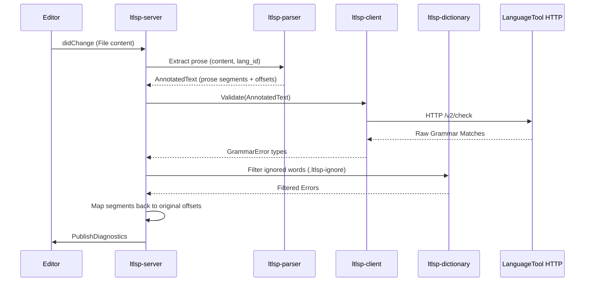

# Architecture

## 1. Overview
`ltlsp` is a Language Server Protocol (LSP) implementation that provides grammar and spelling checking by extracting prose from source code and sending it to a LanguageTool server. It is split into modular crates for separation of concerns.

## 2. Architecture & Flows

The core execution flow is driven by LSP lifecycle events (e.g., `didChange`):

## 3. Modules

*   **`ltlsp-types`**: Core domain types shared across the workspace (`GrammarError`, `TextSegment`, `AnnotatedText`).
*   **`ltlsp-parser`**: Prose extraction engine. Uses `tree-sitter` to parse various languages and extract doc comments/prose while ignoring source code.
*   **`ltlsp-client`**: HTTP client wrapping `reqwest`. Communicates with LanguageTool `/v2/check` API and deserializes responses.
*   **`ltlsp-dictionary`**: Manages a hierarchical, local dictionary. Merges `.ltlsp-ignore` files from the current file up to the workspace root to filter out valid project-specific terminology.
*   **`ltlsp-server`**: Core LSP implementation. Manages server state, coordinates document processing, handles offset mapping, and processes `CodeAction` requests (quick fixes).
*   **`ltlsp`**: Executable entry point. Sets up stdio connection with the editor and starts the async `ltlsp-server` runtime.

## 4. Design Choices & Trade-offs

*   **AST-Based Extraction (`tree-sitter`) vs. Regex**: 
    *   *Choice*: Use `tree-sitter` to explicitly identify comments and prose.
    *   *Trade-off*: Increases binary size and build time due to multiple C-based grammars, but drastically reduces false positives (e.g., ignoring variable names).
*   **Annotated Text Segmentation**: 
    *   *Choice*: Isolate raw source logic from HTTP logic using `AnnotatedText`.
    *   *Trade-off*: Adds intermediate object overhead, but allows marking segments as `is_markup` so LanguageTool can ignore internal formatting (like Markdown bold tags) without breaking offset mapping.
*   **Auto-Provisioned Infrastructure Fallback**: 
    *   *Choice*: If the expected LanguageTool HTTP API is unreachable, `ltlsp-server` attempts to auto-start a local `ghcr.io/garrickwelsh/languagetool` Docker container.
    *   *Trade-off*: Provides a zero-config experience for users with Docker. If Docker is missing and no LanguageTool instance exists, the user is no worse off than if it hadn't tried (graceful failure).
*   **Aggressive Modularization**: 
    *   *Choice*: Split logic into distinct `ltlsp-*` crates.
    *   *Trade-off*: Requires managing a Cargo workspace, but enforces strict boundaries and enables isolated testing.
