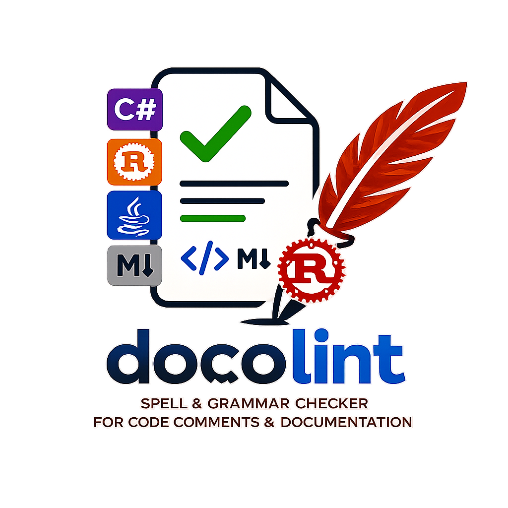

# docolint

Grammar checking and optional spelling checking for code comments and prose — powered by [LanguageTool](https://languagetool.org/) and the Language Server Protocol.

`docolint` uses `tree-sitter` to extract prose from doc comments, markdown, and other text within source files, then checks it with LanguageTool. Works in Rust, C#, HTML, Markdown, JavaScript/TypeScript, Python, and more.

## Features

- **AST-based extraction** — Uses `tree-sitter` to identify doc comments and prose, avoiding false positives on variable names and code
- **Inline diagnostics** — Grammar and optional spelling errors appear directly in your editor
- **Quick fixes** — Apply suggested replacements or ignore words with a single action
- **Hierarchical ignore files** — `.docolint-ignore` files work like `.gitignore`, scoped from file to workspace root
- **Zero-config** — Auto-starts a local LanguageTool container via Docker or Podman if no local server is reachable
- **Multi-language** — Supports Rust, C#, HTML, Markdown, JavaScript, TypeScript, Python, Java, Bash, PowerShell, SCSS, CSS, and Lua

## Requirements

A running LanguageTool HTTP server. By default, `docolint` expects one at `http://localhost:8081`.

If no local server is reachable and Docker or Podman is available, `docolint` automatically starts a local `ghcr.io/garrickwelsh/languagetool` container. Docker is tried first, then Podman.

If Docker-from-Docker is detected, `docolint` automatically uses host networking so the shared LanguageTool server is reachable on `localhost`.

For manual container commands and advanced networking details, see [docs/LANGUAGETOOL.md](docs/LANGUAGETOOL.md).

## Installation

See [docs/INSTALL.md](docs/INSTALL.md).

## Editor Configuration

See editor-specific docs:

- [Helix configuration](docs/HELIX.md)
- [Neovim configuration](docs/NEOVIM.md)

### VS Code

VS Code support may be added in the future.

## Supported Languages

See [docs/SUPPORTED_LANGUAGES.md](docs/SUPPORTED_LANGUAGES.md).

## Ignoring Words

Create a `.docolint-ignore` file in your project root or any subdirectory. Each line contains one word to ignore:

```
# Project-specific terms
docolint
tree-sitter
languagetool
```

Words are matched case-insensitively. Ignore files are merged hierarchically from the current file up to the workspace root.

When hovering over a grammar error, quick-fix actions let you add the offending word to a `.docolint-ignore` file at any directory level.

`disableSpellCheck = true` disables LanguageTool's dictionary spelling rule for the configured language, for example `MORFOLOGIK_RULE_EN_AU`, while keeping grammar and context-sensitive rules enabled.

## Architecture

See [ARCHITECTURE.md](ARCHITECTURE.md) for detailed component documentation, execution flow diagrams, and design trade-offs.

## License

MPL-2.0. See [LICENSE](LICENSE) for details.
