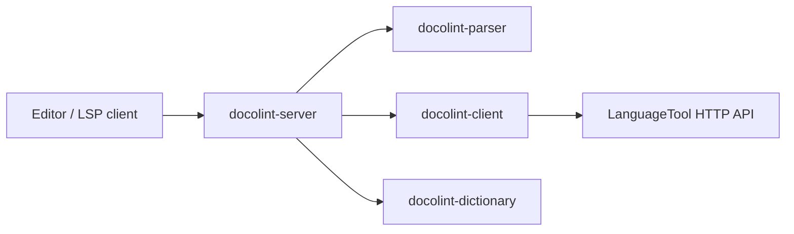
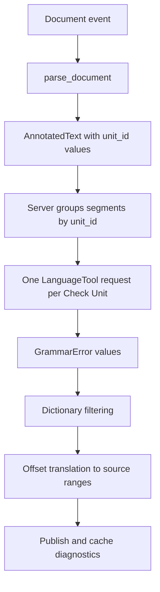
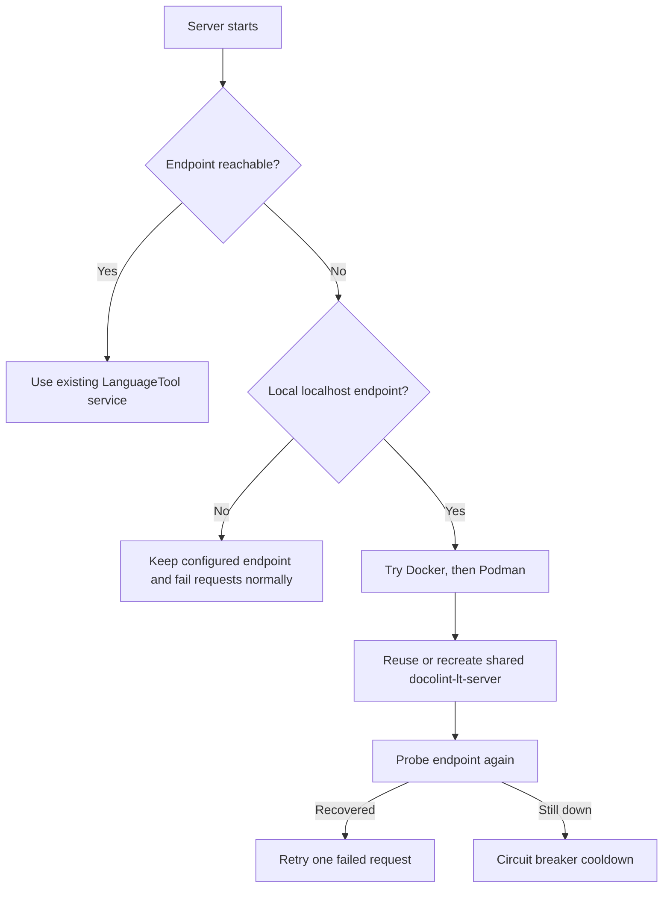
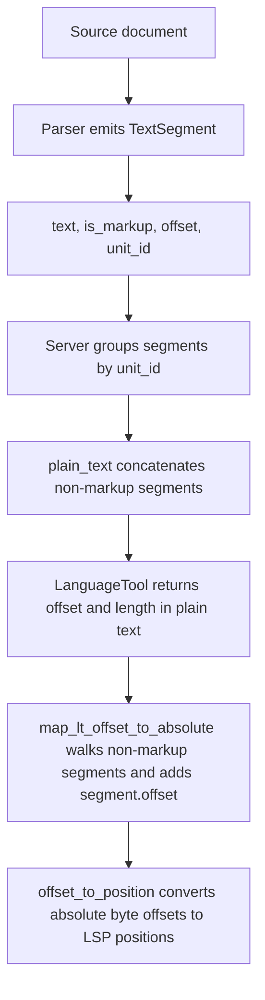

# Diagrams

Contributor-facing diagrams for the main runtime flows.

## Workspace Component Flow



Update when: crate responsibilities or main cross-crate calls change.

## Check-Unit Diagnostic Flow



Update when: check-unit grouping, filtering order, or diagnostic publication changes.

## LanguageTool Startup And Recovery Flow



Update when: recovery order, container runtime behavior, or retry policy changes.

## Offset Translation Flow



Plain-text example:

```text
source:   "/// A sentnce."
segments: ["A sentnce." at source byte offset 4]
LT:       offset 2, length 7
map:      plain-text offset 2 -> source byte offset 6
result:   byte offsets -> LSP range via offset_to_position()
```

Update when: `TextSegment` structure, plain-text concatenation, or offset mapping logic changes.
